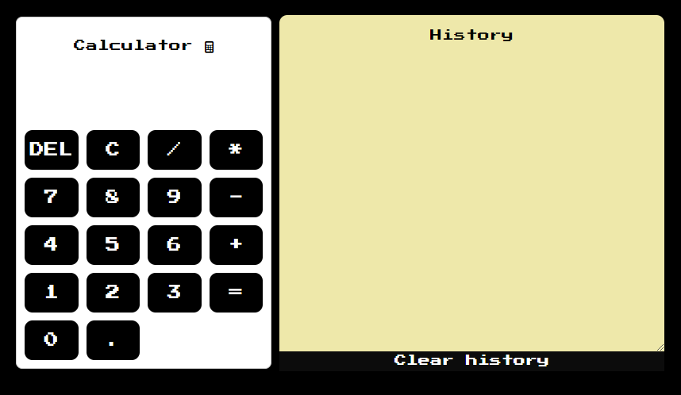

# Projects 1, 3:
Mr. Stanisław Bajor has been assigned to the project. It consists solely of HTML and CSS, with Jekyll (site generator by Ruby) facilitating easy
deployment to GitHub Pages.  

## Website: [https://rustampy.github.io/test-project/about](https://rustampy.github.io/test-project/about)
## Calculator: [https://rustampy.github.io/test-project//projects/calculator](https://rustampy.github.io/test-project/projects/calculator)

# Project 2:
Mr. Roman Haligowski has been assigned to the project.   

## Website: [https://rustampy.github.io/test-project/projects/project_1](https://rustampy.github.io/test-project/projects/project_1)
WCAG guidelines:
* Text Alternatives (WCAG 1.1.1): I made all images have descriptive alt text to convey their content and function to screen readers.
* Audio Description (WCAG 1.2.5): A requirement focused on providing audio descriptions in addition to the regular soundtrack for videos.
* Color Contrast (WCAG 1.4): I used sufficient color contrast between text and background to ensure readability for users with visual impairments.
* Keyboard Accessibility (WCAG 2.1.1): I made sure all interactive elements are accessible via keyboard navigation without relying solely on mouse input. F.e. you can scroll the page using Down arrow button.
* Seizures and Physical Reactions (WCAG 2.3.1): I didn't use the content that could potentially induce seizures (e.g., rapidly flashing content).
* Page Titled (WCAG 2.4.2): Every page should have a descriptive and unique title to aid navigation and orientation.
* Descriptive Links (WCAG 2.4.4): I used descriptive link text that provides context about the destination or action, rather than vague phrases like "click here" or "read more".
* Headings and Labels (WCAG 2.4.6): I organized content using clear headings and labels to help users navigate and understand the structure of the website.
* Form Accessibility (WCAG 3.3.2): Forms are accessible and include clear instructions, error messages, and labels associated with form fields to assist users in completing them accurately.
* Compatible (WCAG 4.1.1): I maximized compatibility with assistive technologies and browsers by using valid HTML and following best practices.
